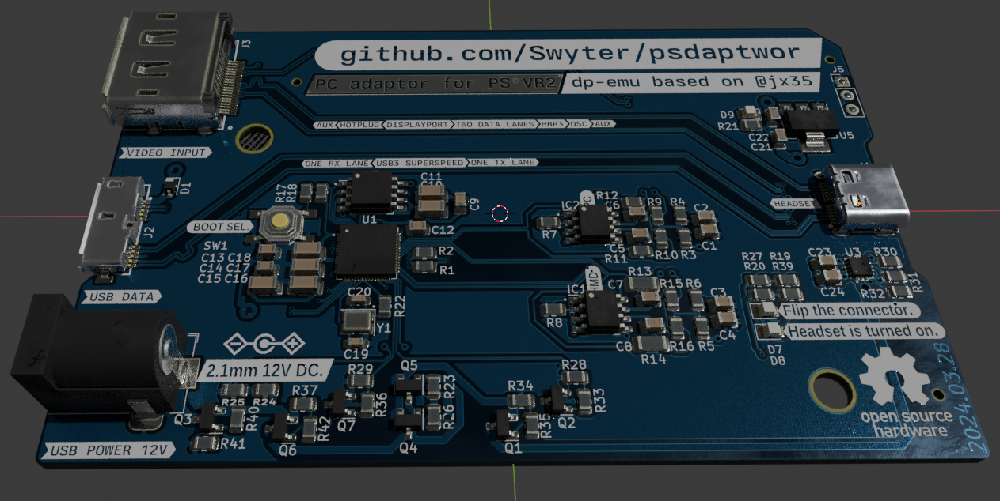

# What is `psdaptwor`?
An experimental PC adapter for EPCOT —the PlayStation®VR2 headset— that splits USB Type-C® into DisplayPort video, USB 3 data and power. Intercepting its DP-AUX/SBU and CC side channels.

> **Important**: *This is my first electronics project and I am still ironing the whole thing out, I have gotten here with a lot of hints and reviews from people who actually know what they are doing, but it should be considered non-functional, for now.*

# How do I get one?
Once the project is properly tested and the design is finalized we will provide the manufacturing files to order assembled boards from any affordable printed circuit board (PCB) fabrication house.
The final aim of the project is that one assembled adapter should cost less than 50€; the design and components are being aggresively optimized as much as possible. Getting one or two should be feasible for almost anyone.

# What does it look like?
More or less like this, the dimensions are around *6.3 x 10.2 centimeters*; much tinier than it looks like here:

# What is that name? Do you know how to spell?

No, it is not a typo. I needed something that could be unique and searchable, and contained `PS`, `VR` and `two` somewhere.
Sony products (like the memory card USB one) seem to call their adapters adaptors, so I follow their naming scheme.  

You can call it the *pee ess virtual adaptor*. :)

# Credits and acknowledgements
* *`@JX35`*: For the *DisplayPort AUX emulator* board this is heavily based on, and uncountable references, ideas and suggestions.
* *`@mrandTX`*: Hardware reviews, many suggestions, things I wouldn't have even thought about and encouragement.
* *`@thaytan`, `@ivry.vr` and many others around the Monado project*: Crucial research and development about how the PS®VR2 hardware and software actually functions. Standing on the shoulders of giants, this just cobbles stuff together. Many thanks.
